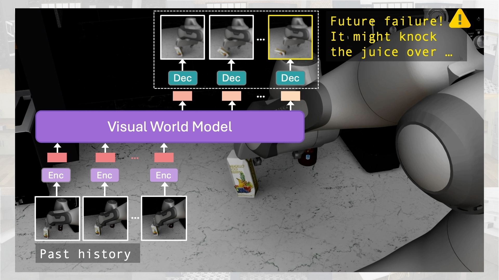

# Sirius-Fleet: Multi-Task Interactive Robot Fleet Learning with Visual World Models

<a href="https://ut-austin-rpl.github.io/sirius-fleet/" target="_blank"></a>

[Huihan Liu](https://huihanl.github.io/), [Yu Zhang](https://www.linkedin.com/in/yu-zhang-b004a9290/?trk=contact-info), [Vaarij Betala](https://www.linkedin.com/in/vaarij-betala/), [Evan Zhang](https://www.linkedin.com/in/evan-zhang-81a9a9269/), [James Liu](https://www.linkedin.com/in/jamesshuangliu/), [Crystal Ding](https://www.linkedin.com/in/ding-crystal/), [Yuke Zhu](https://yukezhu.me/)
<br> [UT Austin Robot Perception and Learning Lab](https://rpl.cs.utexas.edu/)
<br> Conference on Robot Learning, 2024
<br> **[[Paper]](https://arxiv.org/abs/2410.22689)** &nbsp;**[[Project Website]](https://ut-austin-rpl.github.io/sirius-fleet/)**

This codebase is build off open-source codebase [robocasa](https://github.com/robocasa/robocasa) and [robomimic](https://github.com/ARISE-Initiative/robomimic). 

## Installation

1. Install robocasa

Install robocasa with the following procedures. Refer to robocasa [github](https://github.com/robocasa/robocasa) and [documentation](https://robocasa.ai/docs/introduction/installation.html) for more details.

```
# create conda env
conda create -c conda-forge -n robocasa python=3.10
conda activate robocasa

# install robosuite dependency (use the master branch)
git clone https://github.com/huihanl/robosuite-sirius-fleet.git
cd robosuite-sirius-fleet
pip install -e .

# install robocasa
cd ..
git clone https://github.com/robocasa/robocasa
cd robocasa
pip install -e .
pip install pre-commit; pre-commit install           # Optional: set up code formatter.

# (optional: if running into issues with numba/numpy, run: conda install -c numba numba=0.56.4 -y)

# download assets
python robocasa/scripts/download_kitchen_assets.py   # Caution: Assets to be downloaded are around 5GB.
python robocasa/scripts/setup_macros.py              # Set up system variables.
```

3. Install Sirius Fleet

```
git clone https://github.com/UT-Austin-RPL/sirius-fleet
cd sirius-fleet
pip install -e .
pip install -r requirements.txt
```

4. Install diffusers
```
git clone git@github.com:huggingface/diffusers.git
pip install -e diffusers 

"""
(Optional) You might need to remove importing cached_download in src/diffusers/utils/dynamic_modules_utils.py:
 -from huggingface_hub import cached_download, hf_hub_download, model_info
 +from huggingface_hub import hf_hub_download, model_info
"""
```

## Usage 

### Downloading data

#### Downloading original data

robocasa (simulation): Follow robocasa's [documentation](https://robocasa.ai/docs/use_cases/downloading_datasets.html) to download the data. Note that the world model training is using the mimicgen dataset. 

mutex (real robot): Download [mutex](https://ut-austin-rpl.github.io/MUTEX/) dataset [here](https://utexas.app.box.com/s/wepivf85cgini0eqpho9jae9c6o99n4e). 

Create symlinks for the data such that robocasa dataset is at `~/robocasa`, and mutex is at `~/mutex`:

```
ln -s $ROBOCASA_DATASET_PATH ~/robocasa
ln -s $MUTEX_DATASET_PATH ~/mutex
```

#### Downloading human-in-the-loop data

robocasa (simulation): download dataset [here](https://huggingface.co/datasets/huihanl/sirius-fleet-robocasa/tree/main)

mutex (real robot): download dataset [here](https://huggingface.co/datasets/huihanl/sirius-fleet-mutex/tree/main)

Create symlinks for the data so that the human-in-the-loop data will be saved at `~/robocasa-hitl` and `~/mutex-hitl`:

```
ln -s $HITL_ROBOCASA_DATASET_PATH ~/robocasa_hitl
ln -s $HITL_MUTEX_DATASET_PATH ~/mutex_hitl
```

### Training Sirius-Fleet

#### World Model

We suggest that you use the config generation script to generate a json file that is customized to the environments and corresponding datasets. It also allows you specify different hyperparameters using the flags, and also sweep different hyperparameter options. See `gen_config_world_model.py` and `../helper.py` for details.

##### Robocasa: 
```
python robomimic/scripts/config_gen/world_model.py --env robocasa --name world_model --batch_size 8
```

##### Mutex:
```
python robomimic/scripts/config_gen/world_model.py --env mutex --name world_model --batch_size 8
```

This training generates a checkpoint, which we refer to here as `world_model.pth`. It will be used to train the failure classifier below.

#### Failure Classifier

We train the failure classifier based on the world model checkpoint `world_model.pth` from the previous timestep. 

Change the data path for your own task (e.g., `OpenDoorSingleHinge.hdf5`). Note that this dataset is assumed to contain the attribute `intv_labels` as classifier labels. 

```
python robomimic/scripts/train.py --config robomimic/exps/templates/failure_classifier.json --dataset $DATASET_PATH --pretrained_world_model world_model.pth 
```

To finetune failure classifier on a previous failure classifier checkpoint: 

```
python robomimic/scripts/train.py --config robomimic/exps/templates/failure_classifier.json --dataset $DATASET_PATH --pretrained_world_model world_model.pth --classifier_ckpt classifier.pth
```

#### Policy

We use BC-Transformer policy architecture.

##### Robocasa: 
```
python robomimic/scripts/config_gen/bc.py --env robocasa --name bc --n_seeds 3
```

##### Mutex: 
```
python robomimic/scripts/config_gen/bc.py --env mutex --name bc --n_seeds 3
```

To finetune the policy on a previous policy checkpoint:

```
python robomimic/scripts/config_gen/bc.py --env $ENV --name bc --n_seeds 3 --ckpt_path $POLICY_CKPT
```

```
python robomimic/scripts/save_multitask_demos_embedding.py --json_path dataset.json --ckpt_path world_model.pth --save_path ood_embeddings
```

## Acknowledgements

This codebase is largely built off [robocasa](https://github.com/robocasa/robocasa), [robomimic](https://github.com/ARISE-Initiative/robomimic) and [robosuite](https://github.com/ARISE-Initiative/robosuite). 

For real-robot experiments, we used [Deoxys](https://ut-austin-rpl.github.io/deoxys-docs/html/getting_started/overview.html), a controller library for Franka Emika Panda developed by [Yifeng Zhu](https://zhuyifengzju.github.io/).

<br>